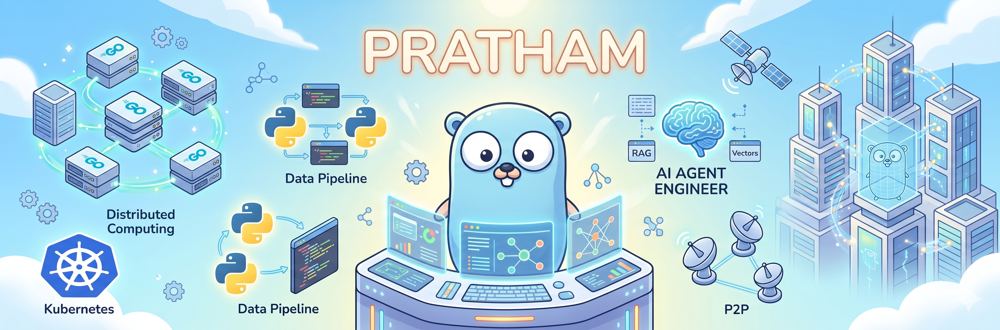

  

  <h1>Hi there, I'm Pratham M J 👋</h1>
  <h3>Distributed Systems Intern @ Akamai &nbsp;·&nbsp; AI Engineer &nbsp;·&nbsp; PES University</h3>

  

    
    
    
  

---

> **Architecting scalable distributed infrastructure and building intelligent AI agents.**

Currently focused on large-scale compute using Go at **Akamai Technologies**. I also design robust developer tooling and complex AI workflows, including multi-agent networks and RAG pipelines.

*   **Currently Interning at:** Akamai (Distributed Computing & Systems Design)
*   **Currently Building:** **ErrorX** (LangGraph bug injection engine) & **Eco-Score.AI** (Autonomous environmental analysis engine)
*   **Interests:** Distributed Systems, Cloud Architecture (Pub/Sub, P2P), LLM Pipelines, Agentic Frameworks

---

### ⚡ Tech Stack

**Languages**

  
  
  
  
  

**AI / ML**

  
  
  
  
  
  
  
  
  
  
  

**Backend & Infrastructure**

  
  
  
  
  
  
  

**DevOps & Tooling**

  
  
  
  

---

### 🚀 Featured Projects

| Project | Description | Stack |
| :--- | :--- | :--- |
| **[ErrorX](https://github.com/Pratham-M-J)** | LangGraph pipeline that searches, clones, and injects production-grade bugs for developer benchmarking. | `Python`, `LangGraph`, `FAISS`, `ChromaDB` |
| **[Eco-Score.AI](https://github.com/Pratham-M-J)** | Autonomous engine scraping product data to predict carbon emissions using refined ML models. | `Python`, `PyTorch`, `FastAPI` |
| **[ADGM Corporate Agent](https://github.com/Pratham-M-J/ADGM-Corporate-Agent)** | Multi-agent document compliance system for regulatory analysis and automated DOCX rewriting. | `LangChain`, `CrewAI`, `ChromaDB` |
| **[YAK — Yet Another Kafka](https://github.com/Pratham-M-J/YAK)** | Lightweight distributed message broker with leader election, synchronous replication, and partitioning. | `Python`, `Flask`, `Redis` |
| **[Multi-Agent Stock Analyzer](https://github.com/Pratham-M-J/Multi-Agent-stock-analyzer)** | Real-time stock news collection and sentiment analysis using specialized agents. | `Python`, `CrewAI` |
| **[Agentic-RAG](https://github.com/Pratham-M-J/Agentic-RAG)** | LlamaIndex-powered agentic document Q&A with intelligent query routing. | `Python`, `LlamaIndex` |

---

  

